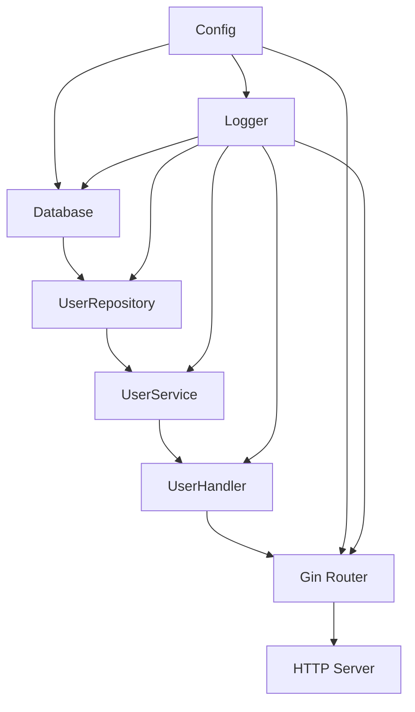

# 🚀 Project Status: Uber Fx Dependency Injection Complete

## ✅ **Implementation Summary**

The Easy Orders Backend now has a **complete dependency injection architecture** using Uber Fx, providing enterprise-grade patterns and clean architecture.

## 📊 **What We've Built**

### **Core Infrastructure** (100% Complete)

- ✅ **Environment Configuration** - .env file integration with Docker Compose
- ✅ **Structured Logging** - Uber Zap integration with request/response logging
- ✅ **Database Integration** - PostgreSQL + GORM with lifecycle management
- ✅ **HTTP Server** - Gin router with graceful shutdown
- ✅ **Docker Setup** - Production and development configurations

### **Dependency Injection Framework** (100% Complete)

- ✅ **Modular Architecture** - Core, Application, and Server modules
- ✅ **Interface-Based Design** - Clean contracts for all components
- ✅ **Automatic Wiring** - Zero manual dependency management
- ✅ **Lifecycle Management** - Proper startup/shutdown sequences
- ✅ **Type Safety** - Compile-time dependency validation

### **Application Architecture** (Foundation Complete)

- ✅ **Repository Layer** - Interface-based data access patterns
- ✅ **Service Layer** - Business logic with clean interfaces
- ✅ **Handler Layer** - HTTP controllers with proper error handling
- ✅ **API Routes** - RESTful endpoints with structured responses

### **Development Experience** (100% Complete)

- ✅ **Hot Reload** - Air integration for development
- ✅ **Environment Management** - Docker Compose .env support
- ✅ **Health Monitoring** - Service health checks
- ✅ **Request Logging** - Structured HTTP request/response logs
- ✅ **Makefile Commands** - Convenient development commands

## 🏗️ **Project Structure**

```
easy-orders-backend-golang-task-2025/
├── cmd/server/main.go                     # Application entry point with Fx
├── internal/
│   ├── fx/                                # Dependency injection modules
│   │   ├── modules.go                    # Core infrastructure (config, logger, DB)
│   │   ├── repositories.go              # Repository module registration
│   │   ├── services.go                  # Service module registration
│   │   ├── handlers.go                  # Handler module registration
│   │   └── server.go                    # HTTP server module
│   ├── config/config.go                 # Environment configuration
│   ├── repository/                      # Data access layer
│   │   ├── interfaces.go               # Repository contracts
│   │   └── user_repository.go          # User data access implementation
│   ├── services/                        # Business logic layer
│   │   ├── interfaces.go               # Service contracts
│   │   └── user_service.go             # User business logic implementation
│   └── api/handlers/                    # HTTP handlers
│       └── user_handler.go             # User HTTP controllers
├── pkg/
│   ├── database/database.go            # Database utilities
│   └── logger/logger.go                # Zap logger wrapper
├── docker/                             # Docker configurations
├── .env                                # Environment variables
├── docker-compose.yml                 # Production setup
├── docker-compose.dev.yml             # Development setup
├── Makefile                           # Development commands
└── go.mod                             # Dependencies with Fx + Zap
```

## 🔗 **Dependency Injection Flow**



## 🎯 **Available API Endpoints**

### **Health & Monitoring**

- `GET /health` - Service health check
- `GET /api/v1/ping` - API connectivity test

### **User Management**

- `POST /api/v1/users` - Create new user
- `GET /api/v1/users` - List all users (paginated)
- `GET /api/v1/users/:id` - Get user by ID
- `PUT /api/v1/users/:id` - Update user
- `DELETE /api/v1/users/:id` - Delete user

### **Authentication**

- `POST /api/v1/auth/login` - User authentication

All endpoints include:

- **Structured logging** (request/response details)
- **Error handling** (proper HTTP status codes)
- **Dependency injection** (automatic service/repository wiring)

## 🚀 **Getting Started**

### **Development**

```bash
# Setup environment
make env-setup

# Start development with hot reload
make dev

# Or manually
docker-compose -f docker-compose.dev.yml up
```

### **Production**

```bash
# Start all services
make docker-up

# Or manually
docker-compose up -d
```

### **Validation**

```bash
# Check configuration
make env-check

# Validate everything
make validate
```

## 🔧 **Key Features Implemented**

### **1. Clean Architecture**

- **Interface-based design** with clear contracts
- **Separation of concerns** across layers
- **Dependency inversion** principle applied

### **2. Enterprise Patterns**

- **Dependency injection** with automatic wiring
- **Lifecycle management** for proper resource handling
- **Modular architecture** for maintainability

### **3. Development Experience**

- **Hot reload** for fast development cycles
- **Environment configuration** through .env files
- **Structured logging** for observability
- **Health checks** for monitoring

### **4. Production Ready**

- **Graceful shutdown** handling
- **Error handling** with proper HTTP codes
- **Configuration validation**
- **Docker deployment** support

## 📈 **Performance & Scalability**

The architecture is designed for:

- **Concurrent processing** (ready for worker pools)
- **Horizontal scaling** (stateless design)
- **Resource management** (proper connection pooling)
- **Observability** (structured logging throughout)

## 🎯 **Next Implementation Phases**

The DI foundation is complete and ready for:

### **Phase 1: Database Models** (Ready to implement)

- GORM entities with relationships
- Database migrations
- Data validation

### **Phase 2: Business Logic** (Ready to implement)

- Order processing pipeline
- Inventory management
- Payment processing

### **Phase 3: Concurrency Features** (Architecture ready)

- Worker pools
- Background jobs
- Real-time processing

### **Phase 4: Advanced Features** (Foundation ready)

- JWT authentication middleware
- Rate limiting
- API documentation

## ✨ **Benefits Achieved**

1. **🏗️ Enterprise Architecture** - Clean, maintainable, scalable design
2. **🔄 Zero Configuration** - Automatic dependency resolution
3. **🧪 Highly Testable** - Easy mocking and unit testing
4. **📦 Modular Design** - Components can be developed independently
5. **🚀 Production Ready** - Proper lifecycle and error handling
6. **🔒 Type Safe** - Compile-time dependency validation
7. **📊 Observable** - Comprehensive logging and monitoring
8. **🔧 Developer Friendly** - Hot reload and convenient tooling

## 🎊 **Conclusion**

The **Uber Fx dependency injection implementation is complete** and provides a solid foundation for building the concurrent order processing system. The architecture follows enterprise best practices and is ready for the next phase of feature development.

**Status: ✅ DI Architecture Complete - Ready for Business Logic Implementation**
