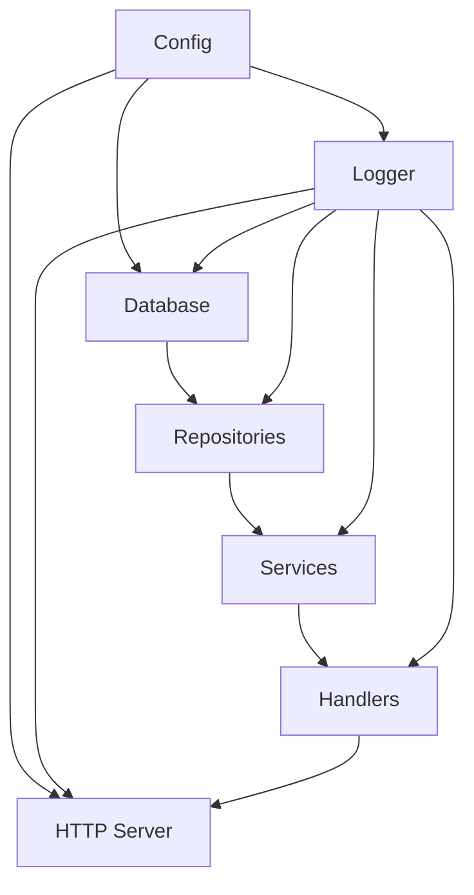

# Dependency Injection with Uber Fx

## 🎯 **Overview**

The Easy Orders Backend now uses **Uber Fx** for dependency injection, providing:

- **Clean Architecture** with clear separation of concerns
- **Automatic Dependency Resolution** - no manual wiring
- **Lifecycle Management** - proper startup/shutdown sequences
- **Testability** - easy to mock dependencies
- **Modularity** - components organized in logical modules

## 🏗️ **Architecture Layers**

### **1. Configuration Layer**

```text
// internal/fx/modules.go - ConfigModule
Config → All Components
```

### **2. Infrastructure Layer**

```text
// internal/fx/modules.go - LoggerModule, DatabaseModule
Config → Logger → Database
```

### **3. Repository Layer**

```text
// internal/fx/repositories.go - RepositoriesModule
Database + Logger → Repositories (Interface-based)
```

### **4. Service Layer**

```text
// internal/fx/services.go - ServicesModule
Repositories + Logger → Services (Interface-based)
```

### **5. Handler Layer**

```text
// internal/fx/handlers.go - HandlersModule
Services + Logger → HTTP Handlers
```

### **6. Server Layer**

```text
// internal/fx/servers.go - ServerModule
Config + Logger + Handlers → HTTP Server
```

## 🔗 **Dependency Flow**



## 📦 **Module Structure**

### **Core Modules** (`fx.CoreModules`)

```text
// Essential infrastructure components
fx.Options(
    ConfigModule,    // Environment configuration
    LoggerModule,    // Structured logging (Zap)
    DatabaseModule,  // PostgreSQL + GORM
)
```

### **Application Modules** (`fx.ApplicationModules`)

```text
// Business logic components
fx.Options(
    RepositoriesModule,  // Data access layer
    ServicesModule,      // Business logic layer
    HandlersModule,      // HTTP request handlers
)
```

### **Server Module** (`fx.ServerModule`)

```text
// HTTP server with Gin
fx.Module("server",
    fx.Provide(NewGinEngine),
    fx.Provide(NewHTTPServer),
    fx.Invoke(RegisterServerLifecycle),
)
```

## 🔌 **Interface-Based Design**

### **Repository Interfaces**

```text
// internal/repository/interfaces.go
type UserRepository interface {
    Create(ctx context.Context, user *User) error
    GetByID(ctx context.Context, id string) (*User, error)
    // ... other methods
}
```

### **Service Interfaces**

```text
// internal/services/interfaces.go
type UserService interface {
    CreateUser(ctx context.Context, req CreateUserRequest) (*UserResponse, error)
    GetUser(ctx context.Context, id string) (*UserResponse, error)
    // ... other methods
}
```

### **Implementation Registration**

```text
// Fx automatically wires interfaces to implementations
fx.Annotate(
    repository.NewUserRepository,
    fx.As(new(repository.UserRepository)),
),
fx.Annotate(
    services.NewUserService,
    fx.As(new(services.UserService)),
),
```

## 🚀 **Lifecycle Management**

### **Database Connection**

```text
// Automatic startup/shutdown
fx.Invoke(func(lc fx.Lifecycle, db *database.DB, logger *logger.Logger) {
    lc.Append(fx.Hook{
        OnStart: func(ctx context.Context) error {
            // Database is already connected
            return nil
        },
        OnStop: func(ctx context.Context) error {
            return db.Close()  // Clean shutdown
        },
    })
})
```

### **HTTP Server**

```text
// Graceful server management
lc.Append(fx.Hook{
    OnStart: func(ctx context.Context) error {
        go server.ListenAndServe()  // Non-blocking start
        return nil
    },
    OnStop: func(ctx context.Context) error {
        shutdownCtx, cancel := context.WithTimeout(ctx, 30*time.Second)
        defer cancel()
        return server.Shutdown(shutdownCtx)  // Graceful shutdown
    },
})
```

## 🧪 **Testing Benefits**

### **Easy Mocking**

```text
// Test setup with mocked dependencies
func TestUserService(t *testing.T) {
    app := fx.New(
        fx.Supply(mockUserRepo),  // Mock repository
        fx.Supply(mockLogger),    // Mock logger
        fx.Provide(services.NewUserService),
        fx.Invoke(func(service services.UserService) {
            // Test the service
        }),
    )
}
```

### **Integration Testing**

```text
// Full integration test with real dependencies
func TestUserAPI(t *testing.T) {
    app := fx.New(
        fx.CoreModules,           // Real infrastructure
        fx.ApplicationModules,    // Real business logic
        fx.Invoke(func(handler *handlers.UserHandler) {
            // Test HTTP endpoints
        }),
    )
}
```

## 📁 **File Organization**

```
internal/
├── fx/                     # Fx modules
│   ├── modules.go         # Core infrastructure modules
│   ├── repositories.go    # Repository module
│   ├── services.go        # Service module
│   ├── handlers.go        # Handler module
│   └── server.go          # Server module
├── repository/            # Data access layer
│   ├── interfaces.go      # Repository contracts
│   └── user_repository.go # User repository implementation
├── services/              # Business logic layer
│   ├── interfaces.go      # Service contracts
│   └── user_service.go    # User service implementation
└── api/handlers/          # HTTP handlers
    └── user_handler.go    # User HTTP handlers
```

## 🔧 **Adding New Components**

### **1. Create Interface**

```text
// internal/repository/interfaces.go or internal/services/interfaces.go
type NewComponentInterface interface {
    DoSomething(ctx context.Context) error
}
```

### **2. Create Implementation**

```text
// internal/repository/new_component.go
func NewComponentRepository(deps...) NewComponentInterface {
    return &componentRepository{...}
}
```

### **3. Register with Fx**

```text
// internal/fx/repositories.go or internal/fx/services.go
fx.Annotate(
    NewComponentRepository,
    fx.As(new(NewComponentInterface)),
),
```

### **4. Use in Dependent Components**

```text
// Constructor automatically receives the dependency
func NewServiceThatNeedsComponent(comp NewComponentInterface) ServiceInterface {
    return &service{component: comp}
}
```

## ✨ **Benefits Achieved**

1. **🔄 Automatic Wiring** - No manual dependency setup
2. **🏗️ Clean Architecture** - Clear layer separation
3. **🧪 Testable** - Easy mocking and isolation
4. **📦 Modular** - Components organized logically
5. **🚀 Lifecycle Management** - Proper startup/shutdown
6. **🔒 Type Safety** - Compile-time dependency checking
7. **📚 Standard** - Industry-standard DI patterns

## 🎯 **Current API Endpoints**

With the DI setup complete, these endpoints are now available:

- `GET /health` - Health check
- `GET /api/v1/ping` - API ping
- `POST /api/v1/users` - Create user
- `GET /api/v1/users` - List users
- `GET /api/v1/users/:id` - Get user
- `PUT /api/v1/users/:id` - Update user
- `DELETE /api/v1/users/:id` - Delete user
- `POST /api/v1/auth/login` - Authenticate user

All endpoints automatically benefit from:

- **Structured logging** (request/response logging)
- **Error handling** (proper HTTP status codes)
- **Dependency injection** (services, repositories)
- **Configuration** (from environment variables)

The DI foundation is now ready for expanding to the full concurrent order processing system! 🚀
